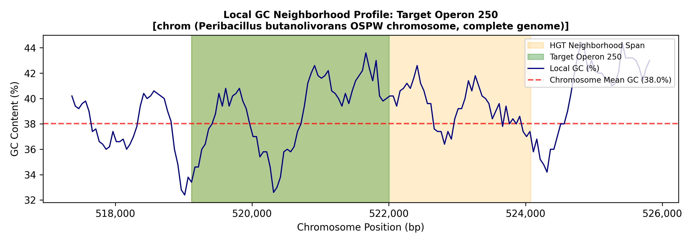

# MGE Scanner

`mge-scanner` is a command-line tool designed to screen genomic neighborhoods around target genes or operons for Horizontal Gene Transfer (HGT) indicators, Mobile Genetic Element (MGE) markers, and local GC content anomalies. It automatically generates detailed text reports, summary tables, and publication-ready GC profile plots.

---

## Features

* **Flexible Operation:** 
  * **Gene Mode:** Directly scans specific target locus tags.
  * **Operon Mode:** Maps multi-gene operon IDs indexed by CSV file to scan neighborhood regions.
* **Flexible Scanning Modes:** Multiple strategy configurations for defining neighborhood boundaries and windows.
* **GC Content Anomaly Detection:** Calculates baseline genomic GC statistics and flags local Z-score drops.
* **Automated Visualization:** Generates detailed neighborhood GC plots highlighting target features and HGT indicators.

---

## Installation

Clone the repository and install the package locally in editable mode using `pip`:

```bash
git clone https://github.com/kiragoff/mge-scanner.git
cd mge-scanner
pip install -e .
```


## Usage

Once installed, you can use the mge-scan command directly from your terminal.

```bash
Example Command (Gene Mode)
mge-scan --gbff genome.gbff \
         --mode gene \
         --source-type file \
         --target-list targets.txt \
         --out-dir ./output_results
```

| Argument | Description | Default |
| :--- | :--- | :--- |
| `--gbff` | Path to the GenBank (.gbff/.gbk) annotation file. | *Required* |
| `--mode` | Screening mode: either `gene` or `operon`. | `gene` |
| `--csv` | Path to CSV mapping file (required if using `operon` mode). | None |
| `--source-type` | Target input source: `file` or `folder`. | `file` |
| `--source-list` | Path to a text file containing target locus tags or operons. Required for 'file' mode. | None |
| `--source-folder` | Path to a folder with files containing target names. Required for 'folder' mode.  | None |
| `--file-pattern` | Patterns for file names that include targets. | `*.0.faa`  (e.g. operon_278.0.faa) |
| `--out-dir` | Directory where all reports and plots will be saved. | `.mge_results/` |
| `--plot-dir` | Directory in out-dir where all plots will be saved. | `.meg_results/neighbourhood_plots` |
| `--out-zscore` | Save path for global GC abnormalies file. | `.mge_results/gc_anomolies.txt` |
| `--z-threshold` | Z-score threshold for local GC anomaly detection. | `-2.0` |
| `--z-window-size` | Window size in bp for chromosomal Z-score scan. | `250` |
| `--z-step-size` | Step size in bp for chromosomal Z-score scan. | `50` |
| `--max-genes` | Maximum number of genes up and downstream to scan for annotations. | `15` |
| `--max-bp` | Maximum number of basepairs up and downstream to scan for annotations. | `1500` |
| `--scan-mode` | Neighborhood search strategy (`a`, `b`, or `c`). | `a` |
| `--flank-bp` | Flanking region size (base pairs) to scan for GC anomalies. | `1000` |


## Output Files

* **formatted_hits.txt:** A structured, easy-to-read text report organized by target gene/operon. (Often the most useful file for interpretation.)
* **detailed_report.txt:** Line-by-line detailed log of all detected HGT features and GC anomalies.
* **summary_report.tsv:** A machine-readable summary table of all targets and their flagged indicators.
* **gc_anomalies.txt:** All GC abnormalies across all amplicons from your gbff/gbk
* **neigourhood_plots:** A folder containing GC plots for your target and flanking region

## License

This project is licensed under the MIT License - see the LICENSE file for details.

# Gallery

### 1. GC Profile
*Plots target operons and the potential horizontal gene transfer neighbourhoods againt local GC%.*


### 2. Formatted Hits File
*Example output from the formatted hits file, showing target operons, hgt indicators in your search window, and localized Z-score anomalies for GC ratios.*

```plaintext
===================================================================================================================
DETAILED HGT HIT LIST - SEPARATED BY TARGET OPERON
===================================================================================================================

Target Operon: 250
-------------------------------------------------------------------------------------------------------------------
STREAM       | OPERON   | GENE            | BP RANGE               | PRODUCT                                         
-------------------------------------------------------------------------------------------------------------------
target       | 250      | PBUTOS_00513    | 519,114 - 520,167      | desA Fatty acid desaturase                      
target       | 250      | PBUTOS_00514    | 520,261 - 521,383      | comP histidine kinase                           
target       | 250      | PBUTOS_00515    | 521,395 - 522,004      | citB Response regulator transcription factor    
downstream   | 251      | PBUTOS_00516    | 522,149 - 522,671      | msrA peptide-methionine (S)-S-oxide reductase MsrA
downstream   | 252      | PBUTOS_00517    | 522,726 - 523,512      | PBUTOS_00517 IS3 family transposase             
downstream   | 252      | PBUTOS_00518    | 523,565 - 524,075      | PBUTOS_00518 transposase                        

Target Operon: 1892
-------------------------------------------------------------------------------------------------------------------
STREAM       | OPERON   | GENE            | BP RANGE               | PRODUCT                                         
-------------------------------------------------------------------------------------------------------------------
target       | 1892     | PBUTOS_03071    | 3,038,642 - 3,039,581  | glaH glutarate dioxygenase GlaH                 
flank        | NA       | Flank Region    | 3,039,692 - 3,039,942  | Local Flank Anomaly (Merged 1, Avg Z=-2.00, Avg GC=27.2%)
downstream   | 1893     | PBUTOS_03072    | 3,039,912 - 3,040,254  | PBUTOS_03072 DUF3870 domain-containing protein  
downstream   | 1893     | PBUTOS_03073    | 3,040,280 - 3,041,498  | lhgO L-2-hydroxyglutarate oxidase               
downstream   | 1893     | PBUTOS_03074    | 3,041,517 - 3,042,177  | gntR HTH gntR-type domain-containing protein    
flank        | NA       | Flank Region    | 3,042,092 - 3,042,592  | Local Flank Anomaly (Merged 2, Avg Z=-2.04, Avg GC=27.0%)
downstream   | 1894     | PBUTOS_03075    | 3,042,611 - 3,043,007  | ydeE AraC family transcriptional regulator      
flank        | NA       | Flank Region    | 3,043,092 - 3,043,592  | Local Flank Anomaly (Merged 2, Avg Z=-2.38, Avg GC=25.2%)
downstream   | 1895     | PBUTOS_03076    | 3,043,541 - 3,044,114  | xerD Integrase family protein                   
flank        | NA       | Flank Region    | 3,044,242 - 3,044,492  | Local Flank Anomaly (Merged 1, Avg Z=-2.60, Avg GC=24.0%)
```